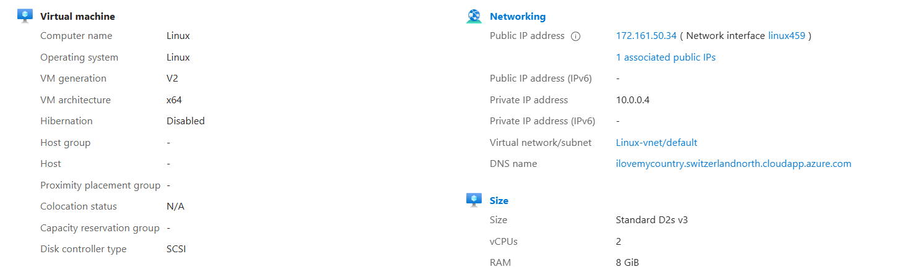
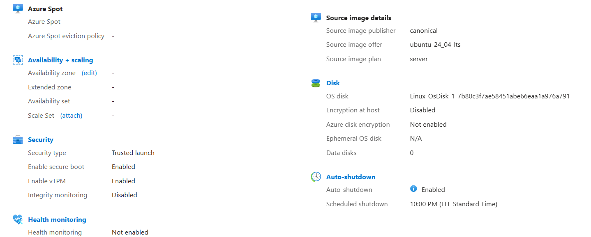

# Linux
Name- Md Afsar Hossain

## Step 1: Azure account creation and free credits
I created a new Azure account using my HAMK student email address at
https://portal.azure.com.

After logging in for the first time, I activated Azure for Students by adding a student subscription while signed in with my student.hamk.fi account.
This provided additional free credits to use Azure resources without charges.

Once the subscription was active, I verified that Azure for Students appeared as the active subscription in the Azure portal.

## Step 2: Creating resource group
From the Azure portal homepage:

I selected Resource groups

Clicked Create

Set:

Resource group name: HossainMD

Region: Switzerland North

Clicked Review + Create, then Create

This resource group is used to organize and manage all resources related to the virtual machine.

## Step 3: Creating virtual machine
From the Azure portal homepage, I selected Create a resource → Virtual machine and used the following settings:

Basic settings

Subscription: Azure for Students

Resource group: HossainMD

Virtual machine name: Linux

Region:  Switzerland North

Image: Ubuntu Server 24.04 LTS (Gen2) published by Canonical

VM size:
Standard D2s v3

Networking

Public IP: Enabled

Inbound ports: Allow SSH (port 22)

Virtual network: New

Subnet: New

After verifying all settings, I clicked Review + Create and then Create.
The deployment completed successfully after a few minutes.

## Step 4: Connected with SSH using PuTTY
To connect to the virtual machine:

Opened PuTTY

Entered:

Host Name: Public IP address of the VM

Port: 22

Connection type: SSH

Clicked Open

Logged in using the username and password created during VM setup

After login, the Ubuntu terminal appeared, confirming a successful SSH connection to the virtual machine.

## Step 5: Created a terminal shortcut key
To make future connections easier:

In PuTTY, I entered the VM’s public IP again

Navigated to Saved Sessions

Named the session (e.g. Azure-Ubuntu-VM)

Clicked Save

This allows quick access to the VM by double-clicking the saved session instead of retyping details.

Conclusion

The Ubuntu Server 24.04 LTS virtual machine was successfully created in Microsoft Azure using the Azure for Students subscription.
A secure SSH connection was established using PuTTY, and the machine is ready to be used as a platform for the course.

## Images

